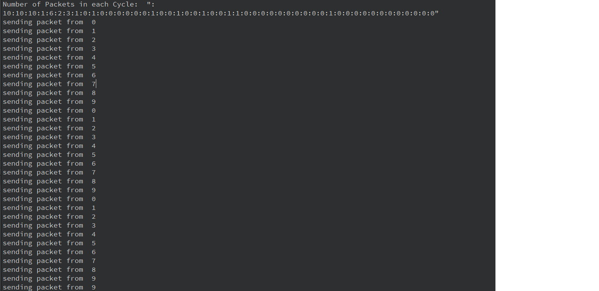
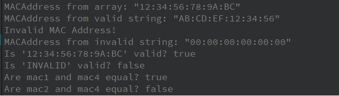
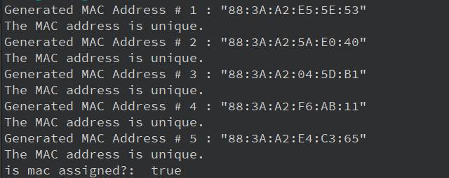

# CN_CA3

## DataGenerator Class

The `DataGenerator` class is responsible for generating data values based on the Pareto distribution. The class is designed to provide flexibility in initialization and data generation parameters.

### Fields

- **`m_minValue`**: A private member variable of type `int` that specifies the minimum value for the Pareto distribution. Defaults to `1`.

### Method Explanations

1. **Constructor**
    - **Default**: Initializes the `DataGenerator` object with default values (`m_minValue` = 1).

    - **Parameterized**: Initializes the `DataGenerator` with a user-defined minimum value for the Pareto distribution.

2. **`generateParetoPacketCounts`**  
   - **Purpose**: Generates packet counts following the Pareto distribution using the formula:  
     $$
     X = \frac{\text{minValue}}  {(1 - U)^{\frac{1}{\alpha}}}
     $$  
     where $U$ is a uniformly distributed random value between 0 and 1, and $\alpha$ is the Pareto shape parameter.  
   - **Details**:  
   We'll discuss a step-by-step explanation of the formula used in `generateParetoPacketCounts` and how it was derived just below.


### Understanding the Pareto Distribution Formula

The probability density function (PDF) is given by:

$$
f(x) = \alpha \frac{{x_m^\alpha}}{{x^{\alpha + 1}}}, \quad x \geq x_m, \, \alpha > 0
$$

Here:
- $x$: The variable of interest.
- $x_m$: The minimum value of $x$ (also called the scale parameter).
- $\alpha$: The shape parameter, controlling the "heaviness" of the distribution tail.

From the PDF, we derive the cumulative distribution function (CDF), which gives the probability that a random variable $X$ is less than or equal to some value $x$:

$$
F(x) = 1 - \left(\frac{x_m}{x}\right)^\alpha, \quad x \geq x_m
$$

To generate a random number following this distribution, we use the inverse transform sampling method.

### Inverse Transform Sampling

The key idea of inverse transform sampling is:
1. Start with a random number $U$ uniformly distributed in \([0, 1]\).
2. Transform $U$ using the inverse of the CDF $F(x)$ to produce a random value $X$ following the desired distribution.

For the Pareto distribution, the CDF is:

$$
F(x) = 1 - \left(\frac{x_m}{x}\right)^\alpha
$$

Setting $F(x) = U$, we get:

$$
U = 1 - \left(\frac{x_m}{x}\right)^\alpha
$$

Rearranging for $x$:
$$
x = x_m \cdot (1 - U)^{-1/\alpha}
$$

This formula allows us to generate a random value $x$ following the Pareto distribution given:

- $U$: A uniformly distributed random value.
- $x_m$: The minimum value (scale parameter).
- $\alpha$: The shape parameter.


## Event Coordinator System  

The **`EventsCoordinator`** class is the backbone of this project, managing the simulation of events and distributing data across PCs at defined intervals.  

### **Header File Explanation**  

The header file defines the structure of the `EventsCoordinator` class:  

- **Key Variables**:  
  - `m_self`: A static instance pointer to ensure this class follows the **Singleton Pattern**, allowing only one instance of the class.  
  - `m_running`: A `bool` to track whether the simulation is active.  
  - `m_intervalMs`: The time (in milliseconds) between events.  
  - `m_durationMs`: The total duration (in milliseconds) for which the simulation will run.  
  - `m_dataArray`: A vector storing the number of data packets to send during each interval.  
  - `m_pcs`: A vector of `PC` objects that receive data.  
  - `m_dataGenerator`: An instance of the `DataGenerator` class, used to generate packet counts.  

- **Key Functions**:  
  - `startSimulation`: Prepares and begins the simulation.  
  - `stopSimulation`: Stops the simulation gracefully.  
  - `run`: The main function executed by the thread to manage events.  
  - `instance` and `release`: Manage the lifecycle of the singleton instance.  


### **Source File Explanation**  

#### **Constructor (`EventsCoordinator`)**  

```cpp
EventsCoordinator::EventsCoordinator(QThread *parent)
    : QThread(parent), m_dataGenerator(new DataGenerator())
{
    std::fill(m_dataArray.begin(), m_dataArray.end(), 0);
}
```

- Initializes the `EventsCoordinator` object.  
- Allocates memory for `m_dataGenerator`.  
- Fills `m_dataArray` with zeros initially.  

#### **Destructor**  

```cpp
EventsCoordinator::~EventsCoordinator()
{
    delete m_dataGenerator;
}
```

- Ensures proper cleanup by deleting the `DataGenerator` instance.  

#### **Singleton Management**  

- **`instance` Function**:  
  ```cpp
  EventsCoordinator *EventsCoordinator::instance(QThread *parent)
  {
      if (!m_self) {
          m_self = new EventsCoordinator(parent);
      }
      return m_self;
  }
  ```
  - Creates or retrieves the single instance of the class.  

- **`release` Function**:  
  ```cpp
  void EventsCoordinator::release()
  {
      delete m_self;
      m_self = nullptr;
      qDebug() << "done";
  }
  ```
  - Deletes the singleton instance and sets the pointer to `nullptr`.  


#### **`startSimulation` Function**  

This is where the simulation setup happens:  

```cpp
void EventsCoordinator::startSimulation(int intervalMs, int durationMs, const QVector<QSharedPointer<PC>> &pcs)
{
    m_intervalMs = intervalMs;
    m_durationMs = durationMs;
    m_pcs = pcs;
    m_dataArray.assign(durationMs / intervalMs, 0);
}
```

1. **Initialize Parameters**:  
   - `m_intervalMs` and `m_durationMs` store the timing configurations.  
   - `m_pcs` is a list of PCs that will receive data.  
   - `m_dataArray` is resized to hold the number of intervals and initialized to zero.  

2. **Data Distribution Logic**:  
   ```cpp
   size_t TOTAL_PACKETS = m_dataArray.size();
   for (size_t i = 0; i < TOTAL_PACKETS; ++i) {
       while (true) {
           size_t generatedData = m_dataGenerator->generateParetoPacketCounts(1) - 1;
           if (generatedData >= m_dataArray.size() || m_dataArray[generatedData] >= m_pcs.size()) {
               continue;
           }
           m_dataArray[generatedData] += 1;
           break;
       }
   }
   ```
   - `TOTAL_PACKETS` determines the total number of time intervals.  
   - For each interval, it generates a random data packet count using Pareto distribution.  
   - **Conditions**:  
     - `generatedData >= m_dataArray.size()`: Ensures the index is within bounds.  
     - `m_dataArray[generatedData] >= m_pcs.size()`: Ensures no single PC is overloaded.  

3. **Debugging Output(For Testing)**:  
   ```cpp
   QString res = "";
   for (size_t i = 0; i < m_dataArray.size(); ++i) {
       res += ":" + QString::number(m_dataArray[i]);
   }
   qDebug() << "Number of Packets in each Cycle:" <<  res;
   ```
   - Displays the data distribution for test and debugging.  

4. Starts the thread by setting `m_running` to `true` and calling `start()`.  


#### **`stopSimulation` Function**  

```cpp
void EventsCoordinator::stopSimulation()
{
    m_running = false;
    wait();
}
```

- Stops the simulation and ensures the thread completes its work before exiting.  


#### **`run` Function**  

The `run` function is the heart of the simulation:  

```cpp
void EventsCoordinator::run()
{
    int cycleCount = m_durationMs / m_intervalMs;
    for (int i = 0; i < cycleCount && m_running; ++i) {
        QVector<QSharedPointer<PC>> selectedPCs;
        if (m_dataArray[i] > 0) {
            std::vector<int> indices(m_pcs.size());
            std::iota(indices.begin(), indices.end(), 0);
            std::shuffle(indices.begin(), indices.end(), std::mt19937{std::random_device{}()});
            for (int j = 0; j < m_dataArray[i]; ++j) {
                selectedPCs.push_back(m_pcs[indices[j]]);
            }
        }
        Q_EMIT nextTick(selectedPCs);
        QThread::msleep(m_intervalMs);
    }
}
```

1. **Calculate Cycles**:  
   - `cycleCount` determines how many intervals will run during the simulation.  

2. **Select PCs**:  
   - If `m_dataArray[i] > 0`, it means there is data to distribute in this interval.  
   - Shuffles the indices of PCs to randomize selection.  
   - Picks PCs based on the data count for that interval.  

3. **Emit Signal**:  
   - Emits the `nextTick` signal with the selected PCs for that interval.  

4. **Delay**:  
   - Waits for `m_intervalMs` milliseconds before moving to the next interval.  


### **Code Flow Summary**  

1. The `startSimulation` function prepares the simulation by initializing variables and distributing data.  
2. The thread begins running the `run` function.  
3. At each interval, it selects PCs and sends data to them using signals.  
4. The simulation continues until the total duration is completed or `stopSimulation` is called.  


## MACAddress Class

The `MACAddress` class represents and validates MAC addresses, providing functionality to store, convert, and validate MAC addresses. It supports initialization from both a string and a byte array.

### Fields

- **`m_address`**: stores the six bytes of the MAC address.

### Method Explanations

1. **Constructors**
    - **with array**:
        - This constructor directly initializes the `m_address` field using a 6-byte array.
    - **with QString**
        - Parses the input string if it follows the format `XX:XX:XX:XX:XX:XX` using the `isValid()` method.
        - If valid, it converts the string to its 6-byte representation. Invalid inputs result in a warning, and the address is set to all zeros.

3. **`toString()`**
   - Generates a colon-separated hexadecimal string representation of the MAC address.

4. **`isValid()`**
   - Uses a regular expression to validate the format of a MAC address string.

5. **Equality Operator (`==`)**
   - Compares each byte of the `m_address` field between two `MACAddress` objects.


## MACAddressGenerator Class

The `MACAddressGenerator` class provides functionality to generate and manage random MAC addresses. It ensures uniqueness by keeping track of previously assigned addresses and generates new ones based on a predefined Organizationally Unique Identifier (OUI).

### Fields

- **`m_assignedMACs`**: A static `QList<MACAddress>` that stores previously assigned MAC addresses to avoid duplication.
- **`m_OUIBytes`**: A static `std::array<uint8_t, 3>` representing the Organizationally Unique Identifier (OUI) portion of a MAC address. This is randomly initialized at runtime.

### Method Explanations

1. **Deleted Constructor**
   - The class is designed as a utility class with only static members and methods. The constructor is explicitly deleted to prevent instantiation.

2. **`generateRandomMAC()`**
   - Generates a MAC address by combining:
     - The predefined OUI bytes stored in `m_OUIBytes`.
     - Three randomly generated NIC-specific bytes.
   - Combines these bytes into a full 6-byte array and returns it as a `MACAddress`.

3. **`isMACAssigned()`**
   - Checks if the given MAC address exists in the `m_assignedMACs` list.
   - Returns `true` if the MAC address has been assigned, `false` otherwise.

4. **`getRandomMAC()`**
   - Calls `generateRandomMAC()` to create a new MAC address.
   - Ensures uniqueness by checking against `m_assignedMACs` using `isMACAssigned()`.
   - If the generated MAC address is already assigned, the method retries until a unique address is generated.
   - The unique address is added to `m_assignedMACs` and returned.


## DataLinkHeader Class

The `DataLinkHeader` class represents the data link layer header used in network communication.

### **Fields**

- **`m_sourceMACAddress`**: Represents the source MAC address of the frame (`MACAddress`).

- **`m_destinationMACAddress`**: Represents the destination MAC address of the frame (`MACAddress`).

### **Methods**

1. **Constructors**

    - Initializes a new `DataLinkHeader` instance with the specified source and destination MAC addresses.
    - A copy constructor that creates a new `DataLinkHeader` by copying the source and destination MAC addresses from another instance.

2. **Setters**

    - Each of the fields has a corresponding setter method.

3. **Getters**
    - Each of the fields has a corresponding getter method.


## TCPHeader Class

The `TCPHeader` class represents the header of a TCP packet.

### Fields

- **`m_sourcePort`**: Stores the source port number (16 bits).
- **`m_destPort`**: Stores the destination port number (16 bits).
- **`m_sequenceNumber`**: Stores the sequence number of the packet (32 bits).
- **`m_acknowledgementNumber`**: Stores the acknowledgment number (32 bits).
- **`m_flags`**: Represents the control flags (8 bits).
- **`m_dataOffset`**: Indicates the size of the TCP header in 32-bit words (8 bits).
- **`m_checksum`**: Stores the checksum for error-checking purposes (16 bits).
- **`m_windowSize`**: Represents the size of the receive window (16 bits).
- **`m_urgentPointer`**: Points to the location of urgent data within the packet (16 bits).

### Methods Explanations

1. **Constructor:**
   - `TCPHeader(QObject *parent = nullptr)`: Initializes the class and sets the default checksum to `0`.

2. **Setters:**
   - Each of the fields has a corresponding setter method, such as `setSourcePort()`, `setDestPort()`, `setSequenceNumber()`, and so on.

3. **Getters:**
   - Each of the fields has a corresponding getter method, such as `sourcePort()`, `destPort()`, `sequenceNumber()`, and so on, to retrieve the value of the field.

4. **`calculateChecksum` Method:**

    - Calculates the checksum for the TCP header using the pseudo-header (source and destination IPs) and the actual header data.
    - Uses a helper function, onesComplementSum, to compute the one's complement sum of the data.

5. **`onesComplementSum` Helper Function:**
    - Computes the one's complement sum for a given byte array.


## Packet Class

The `Packet` class represents a network packet and provides methods to manipulate its properties. It encapsulates various attributes such as packet type, payload, sequence number, waiting and total cycles, and the path it traverses. The class also integrates headers such as `DataLinkHeader` and optionally supports `TCPHeader`.

### Fields

- **`m_packetType`**: An instance of `UT::PacketType` that specifies the type of the packet.
- **`m_payload`**: A `QByteArray` storing the packet's data payload.
- **`m_sequenceNumber`**: A 32-bit unsigned integer representing the packet's sequence number.
- **`m_waitingCycles`**: A 32-bit unsigned integer indicating how many cycles the packet has been waiting.
- **`m_totalCycles`**: A 32-bit unsigned integer tracking the total number of cycles the packet has been in the system.
- **`m_path`**: A `QList<QString>` representing the IP path the packet has traversed.
- **`m_dataLinkHeader`**: An instance of `DataLinkHeader` representing the data link layer header associated with the packet.
- **`m_tcpHeader`**: An optional `TCPHeader` instance providing support for TCP-related information, if applicable.
- **`m_controlType`**: An optional `UT::PacketControlType` for specifying control-related metadata for the packet.

### Constructor

1. **`Packet(DataLinkHeader dataLinkHeader, QObject* parent = nullptr)`**
   - Initializes a `Packet` object with a given `DataLinkHeader`.
   - Sets `m_totalCycles` and `m_waitingCycles` to zero.

### Method Explanations

1. **`addToPath(QString ip)`**
   - Adds an IP address to the packet's path.
   - Appends the provided IP string to `m_path`.

2. **`incWaitingCycles()`**
   - Increments the `m_waitingCycles` field by one.

3. **`incTotalCycles()`**
   - Increments the `m_totalCycles` field by one.

4. **Setters**
    - Each of the fields has a corresponding setter method.

5. **Getters**
    - Each of the fields has a corresponding getter method.

### Destructor

- **`~Packet()`**
   - Ensures proper cleanup of the `Packet` instance when it goes out of scope.
  
### Future Expansion
  - IPHeader integration for network layer information.
  
  
## Phase 1 Tests

### **Testing the EventCoordinator System**

To validate the functionality of the `EventCoordinator` system, we implemented `Node` and `PC` classes. These were used to simulate PCs that receive data packets at regular intervals, as coordinated by the EventCoordinator.

#### **Node and PC Implementation**

The `Node` class serves as a base class for the `PC`, representing individual PCs in the system. Each PC can send data packets when connected to the EventCoordinator and received a signal to do so.

**Node Header File:**
```cpp
#ifndef NODE_H
#define NODE_H

#include <QThread>
#include <QDebug>

class Node : public QThread
{
    Q_OBJECT

public:
    explicit Node(QObject *parent = nullptr);
};

#endif    // NODE_H
```

**PC Header File:**
```cpp
#ifndef PC_H
#define PC_H

#include "../Node/Node.h"
#include <QVector>
#include <QSharedPointer>

class PC : public Node
{
    Q_OBJECT

public:
    explicit PC(int id, QObject *parent = nullptr);

public Q_SLOTS:
    void sendPacket(QVector<QSharedPointer<PC>> selectedPCs);

protected:
    int m_id;
};

#endif    // PC_H
```

**PC Source File:**
```cpp
#include "PC.h"

PC::PC(int id, QObject *parent) :
    Node(parent)
{
    m_id = id;
}

void PC::sendPacket(QVector<QSharedPointer<PC>> selectedPCs) {
    if (!selectedPCs.contains(this))
        return;
    qDebug() << "sending packet from " << m_id;
}
```

#### **Testing with Main Function**

The `main` function demonstrates the simulation of the system by:

1. Creating an instance of `EventCoordinator` using its singleton pattern.
2. Initializing 10 PCs.
3. Connecting the EventCoordinator's `nextTick` signal to each PC's `sendPacket` slot.
4. Starting the simulation with an interval of 200 milliseconds and a total duration of 10,000 milliseconds.

**Main Function:**
```cpp
#include "../EventsCoordinator/EventsCoordinator.h"
#include <QCoreApplication>
#include <QObject>

int main(int argc, char *argv[])
{
    QCoreApplication app(argc, argv);

    EventsCoordinator *eventCoordinator = EventsCoordinator::instance();

    QVector<QSharedPointer<PC>> pcs;
    for (int i = 0; i < 10; i++) {
        QSharedPointer<PC> pc = QSharedPointer<PC>::create(i);
        pcs.append(pc);

        QObject::connect(eventCoordinator, &EventsCoordinator::nextTick, pc.get(), &PC::sendPacket);
    }

    eventCoordinator->startSimulation(200, 10000, pcs);
    int result = app.exec();

    EventsCoordinator::release();

    return result;
}
```

---

#### **Output**

The system's test outputs include:
1. A debug log showing the number of data packets distributed in each cycle.
2. Logs for PCs receiving packets, indicating the PC ID.

**Output:**


This output validates that:
- Data distribution among cycles matches the configuration.
- Each PC correctly receives packets when selected.

### **Testing the MAC Address**

```cpp
#include <QCoreApplication>
#include <QDebug>
#include "MACAddress/MACAddress.h"

int main(int argc, char *argv[])
{
    QCoreApplication a(argc, argv);

    std::array<uint8_t, 6> addressArray = {0x12, 0x34, 0x56, 0x78, 0x9A, 0xBC};
    MACAddress mac1(addressArray);
    qDebug() << "MACAddress from array:" << mac1.toString(); //12:34:56:78:9A:BC

    MACAddress mac2("AB:CD:EF:12:34:56");
    qDebug() << "MACAddress from valid string:" << mac2.toString(); //AB:CD:EF:12:34:56

    MACAddress mac3("INVALID:ADDRESS");
    qDebug() << "MACAddress from invalid string:" << mac3.toString(); //00:00:00:00:00:00

    qDebug() << "Is '12:34:56:78:9A:BC' valid?" << mac2.isValid("12:34:56:78:9A:BC"); // true
    qDebug() << "Is 'INVALID' valid?" << mac2.isValid("INVALID"); //false

    MACAddress mac4("12:34:56:78:9A:BC");
    qDebug() << "Are mac1 and mac4 equal?" << (mac1 == mac4); // true
    qDebug() << "Are mac2 and mac4 equal?" << (mac2 == mac4); // false

    return 0;
}
```

**What is being tested**:
1. **MAC Address Initialization**: We test if the `MACAddress` class can correctly handle MAC address initialization from both a byte array and a valid string. Additionally, we check how the class handles an invalid string (expecting it to default to `00:00:00:00:00:00`).
   
2. **MAC Address Validation**: The `isValid()` method is tested to ensure it accurately identifies valid MAC addresses (e.g., `12:34:56:78:9A:BC`) and rejects invalid strings (e.g., `INVALID`).
   
3. **Equality Check**: The `==` operator is tested for comparing two `MACAddress` objects, verifying that the operator correctly identifies equality when two addresses are the same and inequality when they differ.

**Desired Output**:
1. **MACAddress from array**: The output should display `12:34:56:78:9A:BC`, confirming that the class can properly initialize a MAC address from a byte array.
   
2. **MACAddress from valid string**: The output for this MAC address should be `AB:CD:EF:12:34:56`, showing that the class correctly parses a valid MAC address string.

3. **MACAddress from invalid string**: The output should be `00:00:00:00:00:00`, indicating that the class defaults to the "zero" address when provided with an invalid string like `INVALID:ADDRESS`.

4. **MAC Address validation**:
   - It should print `true` for the valid MAC address `12:34:56:78:9A:BC`.
   - It should print `false` for the invalid string `INVALID`.

5. **Equality Check**:
   - It should print `true` when comparing `mac1` and `mac4` because they are the same.
   - It should print `false` when comparing `mac2` and `mac4`, as they are different addresses.

#### **Output**


### Testing the MAC Address Generator

```cpp
#include <QDebug>
#include "MACAddress/MACAddress.h"
#include "MACAddress/MACAddressGenerator.h"

int main()
{
    QList<MACAddress> generatedMACs;

    for (int i = 0; i < 5; ++i) {
        MACAddress randomMAC = MACAddressGenerator::getRandomMAC();
        qDebug() << "Generated MAC Address #" << (i + 1) << ":" << randomMAC.toString();

        bool isUnique = true;
        for (const auto& mac : generatedMACs) {
            if (mac == randomMAC) {
                isUnique = false;
                break;
            }
        }

        if (isUnique) {
            qDebug() << "The MAC address is unique.";
        } else {
            qDebug() << "The MAC address is not unique.";
        }

        generatedMACs.append(randomMAC);
    }
    MACAddress tempMac(generatedMACs.first().toString());
    qDebug() << "is mac assigned?: " << MACAddressGenerator::isMACAssigned(tempMac);
    return 0;
}
```

**What is being tested**:
1. **Random MAC Address Generation**: The `MACAddressGenerator` class is tested to ensure it generates random and valid MAC addresses. We expect the generated addresses to follow the correct format (six groups of two hexadecimal characters separated by colons).

2. **Uniqueness of Generated MAC Addresses**: Each generated MAC address is checked for uniqueness within the current run. We test if the generator produces duplicates by comparing each newly generated address to the previously generated ones.

3. **MAC Address Assignment**: After generating five MAC addresses, we test whether the first MAC address in the list has already been assigned using `isMACAssigned()`. This verifies that the generator is keeping track of generated addresses.

**Desired Output**:
1. **Generated MAC Addresses**: Each of the five generated MAC addresses should be printed in valid MAC address format (e.g., `Generated MAC Address #1: XX:XX:XX:XX:XX:XX`), with each address being different.

2. **Uniqueness Check**: After generating each address, the system should output whether the generated MAC address is unique:
   - "The MAC address is unique." if the address has not been seen before in the current run.
   - "The MAC address is not unique." if the address is a duplicate.

3. **Assigned MAC Check**: After generating the five addresses, the program checks if the first address is assigned by calling `isMACAssigned()`. It will print either `true` or `false`, depending on whether the address has been previously assigned.

#### **Output**

