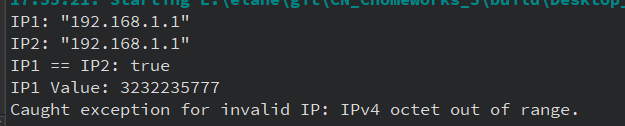
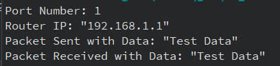
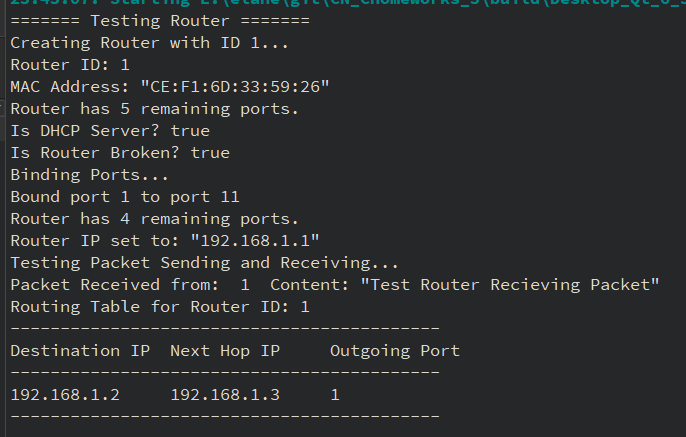
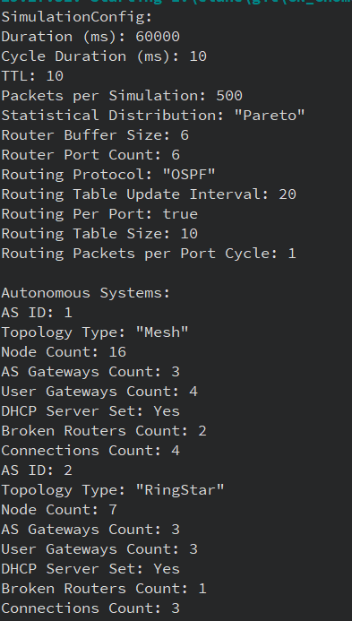
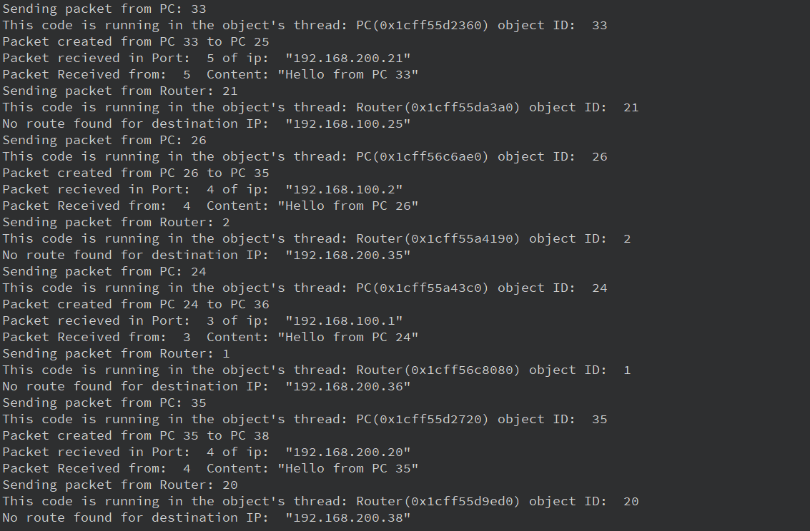
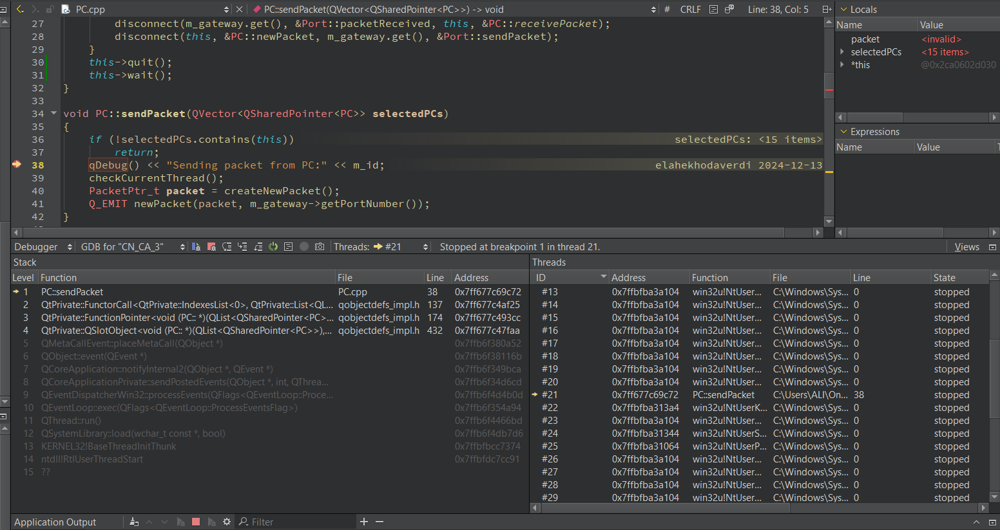

# CN_CA3


## **IP Class**

The **IP** class template provides a structured representation of IPv4 and IPv6 addresses, along with utility methods for manipulation and validation. It inherits from the `AbstractIP` base class.

### **AbstractIP Base Class**

**Fields**

- **m_ipValue**: A `uint64_t` value representing the raw IP address.

**Constructor**

- Default: Initializes `m_ipValue` to `0`.
- Copy Constructor.


### **IP (Specialization for IPv4)**

 **Fields**
- Inherits `m_ipValue` from `AbstractIP`.

 **Constructors**
- **Default**: Sets the IP to the maximum `uint64_t` value.
- **From String**: Accepts an IPv4 string and parses it into `m_ipValue`.
- **From Integer**: Accepts a `uint64_t` value directly.
- **Copy Constructor**: Creates a copy of an existing IPv4 instance.

 **Methods**
1. **toString**:
   - Converts `m_ipValue` into  `"X.X.X.X"` format.
   - Uses bitwise shifts and masks to extract octets.
2. **toValue**:
   - Returns the `uint64_t` representation of the IP.
3. **fromString**:
   - Parses an IPv4 string and updates `m_ipValue`.
   - Validates the format using `validateIPv4String`.
4. **validateIPv4String**:
   - Checks if the input string conforms to the IPv4 standard.
   - Ensures there are four octets, each between `0` and `255`.

5. **Operators**
    - **Equality Operator**: Compares the `m_ipValue` of two IPv4 addresses.


## IPHeader Class

The `IPHeader` class represents the structure and functionality of an IPv4 header, as defined in the Internet Protocol (IP). It provides methods to manage and manipulate various header fields, including version, length, type of service, and other relevant parameters. It also includes functions for setting and retrieving these fields, as well as calculating the header checksum.

### Fields

- **`m_versionHeaderLength`**: Stores the version and header length, combined in one byte.
- **`m_typeOfService`**: Stores the type of service field, typically used for routing priority and delay.
- **`m_totalLength`**: Stores the total length of the IP packet, including both header and data.
- **`m_identification`**: Stores the identification field for uniquely identifying fragmented packets.
- **`m_flagsFragmentOffset`**: Stores flags and fragment offset used for packet fragmentation.
- **`m_ttl`**: Stores the time-to-live value, used to limit the lifetime of a packet.
- **`m_protocol`**: Stores the protocol field, identifying the protocol used in the data portion of the IP packet.
- **`m_headerChecksum`**: Stores the checksum of the header for error-checking.
- **`m_sourceIp`**: Stores the source IP address.
- **`m_destIp`**: Stores the destination IP address.

### Method Explanations

1. **Constructors**
    - **`IPHeader(QObject *parent)`**:
        - Initializes the fields to default values. The `ttl` field is set using a value from the `SimulationConfig::TTL`.

2. **Setters**
    - Each of the fields has a corresponding setter method.

3. **Getters**
    - Each of the fields has a corresponding getter method.

4. **`calculateHeaderChecksum(const QByteArray &data)`**
    - Calculates the header checksum using a method based on the data size and values. It processes the data in 16-bit chunks, adds them together, and performs a final sum adjustment to generate the checksum.


## Node Class

The `Node` class represents a network node within a simulated network environment. This class is designed as an abstract base class for Router and PC. Additionally, it incorporates threading capabilities by inheriting from `QThread`, enabling asynchronous operations.

### Fields

1. **`m_id`**:  
   - Stores the unique identifier of the node.  
   - This ID helps in distinguishing nodes within the network.

2. **`m_MACAddress`**:  
   - Holds the MAC address of the node, uniquely identifying it at the data-link layer.  
   - It is generated using `MACAddressGenerator` if not explicitly provided during construction.

3. **`m_IP`**:  
   - Stores the IP address of the node.  
   - The address is dynamically allocated during object creation using the `IPv4Ptr_t::create()` method.

### Methods Explanation

1. **Constructors**:  
   The `Node` class provides two constructors to handle node initialization:
   - **`Node(int id, MACAddress macAddress, QObject *parent = nullptr)`**:  
     Initializes the node with a specified ID and MAC address.
   - **`Node(int id, QObject *parent = nullptr)`**:  
     Automatically generates a random MAC address for the node using `MACAddressGenerator::getRandomMAC()`.

2. **`~Node()`**:  
   - Destructor for the `Node` class.  
   - Ensures the proper cleanup of the dynamically allocated IP address by clearing the `m_IP` pointer if it is not null.

3. **`int getId()`**:  
   - Returns the unique identifier of the node.  

4. **`IPv4Ptr_t getIP()`**:  
   - Provides access to the node's IP address.

5. **`MACAddress getMACAddress()`**:  
   - Returns the MAC address of the node.

6. **`virtual void setIP(IPv4Ptr_t ip) = 0`**:  
   - A pure virtual function that must be implemented by derived classes.  
   - Defines how a node's IP address is set.

7. **`virtual void receivePacket(const PacketPtr_t &data, uint8_t port_number) = 0`**:  
   - A pure virtual slot to handle incoming packets.  
   - Must be implemented by derived classes to define the behavior upon receiving packets.

8. **`void checkCurrentThread()`**:  
   - Verifies if the current thread is the same as the thread of the object.  
   - Outputs debug information about the current thread and the object's thread.  
   - Useful for ensuring thread safety during multi-threaded operations.

### Signals

1. **`void newPacket(const PacketPtr_t &data, uint8_t port_number)`**:  
   - A Qt signal emitted when a new packet is created and ready to send. 


## PC Class

The `PC` class models a personal computer within a simulated network environment. It extends the `Node` class, inheriting its core functionalities while implementing additional features for sending and receiving packets. The class utilizes Qt's threading and signal-slot mechanisms for asynchronous operations and efficient network simulation.

### Fields

1. **`m_gateway`**:  
   - Represents the gateway port through which the PC communicates with the network.  
   - This is a dynamically allocated `PortPtr_t` object initialized during the construction of the `PC`.

### Methods Explanation

1. **Constructors**:  
   The `PC` class provides two constructors for initialization:  
   - **`PC(int id, MACAddress macAddress, QObject *parent = nullptr)`**:  
     Initializes the PC with a specific MAC address and ID, creating a gateway for network communication.  
     Starts the thread for the object and sets up the gateway.  
   - **`PC(int id, QObject *parent = nullptr)`**:  
     Initializes the PC with a randomly generated MAC address, ID, and gateway.  
     Also starts the thread and sets up the gateway.

2. **`~PC()`**:  
   - Destructor for the `PC` class.  
   - Ensures proper cleanup by unbinding the gateway port from the `PortBindingManager`.  
   - Disconnects any signal-slot connections related to the gateway and packet communication.

3. **`void sendPacket(QVector<QSharedPointer<PC>> selectedPCs)`**:  
   - Sends a packet to one of the selected PCs if the current PC is part of the selection.  
   - Generates a new packet using `createNewPacket()` and emits the `newPacket` signal to initiate transmission.

4. **`PCPtr_t chooseRandomPC()`**:  
   - Randomly selects a PC from the network that is different from the current PC.  
   - Utilizes `QRandomGenerator` to ensure a fair selection.

5. **`PacketPtr_t createNewPacket()`**:  
   - Creates a new data packet destined for a randomly selected PC.  
   - Sets the source and destination MAC and IP addresses within the packet's headers.  
   - Populates the payload with a message and calculates the IP header checksum.  
   - Returns the constructed packet.  

6. **`void receivePacket(const PacketPtr_t &data, uint8_t port_number)`**:  
   - Handles incoming packets through the gateway.  
   - Logs the packet's content and identifies the receiving PC for debugging purposes.

7. **`void setIP(IPv4Ptr_t ip)`**:  
   - Overrides the `Node` class's pure virtual method to set the IP address of the PC.  
   - Updates the router IP address associated with the gateway.

8. **`PortPtr_t gateway()`**:  
   - Returns the gateway port associated with the PC.  
   - Provides access to the port for further configurations or queries.

9. **`void setupGateway()`**:  
   - Configures the gateway by connecting the `packetReceived` signal of the gateway port to the `receivePacket` slot of the PC.  
   - Connects the `newPacket` signal of the PC to the `sendPacket` slot of the gateway port.  
   - Ensures the router IP of the gateway is updated.

### Signals

1. **`void newPacket(const PacketPtr_t &data, uint8_t port_number)`**:  
   - Emitted when a new packet is ready to be sent.  
   - Enables seamless communication with the gateway.  


## Router Class

The `Router` class models a network router in a simulated network environment. As a derived class of `Node`, it incorporates routing-specific functionality and is equipped to handle dynamic networking scenarios. It also utilizes threading capabilities through `QThread` for concurrent operations.

### Fields

1. **`ports`**:  
   - Stores a list of pointers to the router's ports.  
   - Initialized during object creation, with each port dynamically allocated and assigned a unique port number.

2. **`ipVersion`**:  
   - Specifies the IP version used by the router.  
   - Default value is `UT::IPVersion::IPv4`.

3. **`buffer`**:  
   - A queue of packets pending to be processed or forwarded by the router.

4. **`DHCPServer`**:  
   - A boolean indicating whether the router is configured as a DHCP server.

5. **`broken`**:  
   - A boolean indicating whether the router is inoperable.  
   - When true, the router halts packet processing.

6. **`routingTable`**:  
   - A list of routing table entries, each containing destination, subnet mask, next hop, output port, metric, and routing protocol.

7. **`maxPorts`**:  
   - The maximum number of ports available on the router.  
   - Default value is 5.

### Methods Explanation

1. **Constructor**:  
   - Initializes the router with a specified ID and MAC address.  
   - Dynamically allocates ports, assigns port numbers, and sets up signal-slot connections for packet handling.  
   - Moves the router object to its thread for asynchronous operations.  

2. **Destructor**:  
   - Ensures proper cleanup of ports by unbinding them from the `PortBindingManager` and disconnecting signals.  
   - Stops the thread before destruction.

3. **`void setRouterAsDHCPServer()`**:  
   - Configures the router as a DHCP server by setting the `DHCPServer` flag to true.

4. **`void setRouterBroken()`**:  
   - Marks the router as inoperable by setting the `broken` flag to true.

5. **`bool routerIsBroken() const`**:  
   - Returns the status of the `broken` flag, indicating whether the router is operable.

6. **`PortPtr_t getAnUnboundPort() const`**:  
   - Retrieves the first unbound port from the router's list of ports.  
   - Returns `nullptr` if all ports are bound.

7. **`int remainingPorts() const`**:  
   - Returns the number of unbound ports available for use.

8. **`void setIP(IPv4Ptr_t ip)`**:  
   - Assigns the specified IP address to the router and updates all ports with the router's IP.

9. **`void printRoutingTable() const`**:  
   - Outputs the router's routing table, displaying entries such as destination, next hop, output port, and metric.

10. **`bool isDHCPServer() const`**:  
    - Returns the status of the `DHCPServer` flag.

11. **`void addRoutingTableEntry(...)`**:  
    - Adds an entry to the routing table with the specified destination, subnet mask, next hop, output port, metric, and routing protocol.

12. **`void sendPacket(QVector<QSharedPointer<PC>> selectedPCs)`**:  
    - Processes the first packet in the buffer and attempts to forward it through the appropriate port based on the routing table.  
    - Increments the waiting cycles for remaining packets in the buffer.  
    - Emits a `newPacket` signal to send the packet.

13. **`void receivePacket(const PacketPtr_t &data, uint8_t port_number)`**:  
    - Handles incoming packets received on a specific port.  
    - Adds the packet to the buffer if the router is operational.

14. **`uint8_t findSendPort(IPv4Ptr_t destIP)`**:  
    - Determines the output port number for a given destination IP using the routing table.  
    - Returns 0 if no route is found.

### Signals

1. **`void newPacket(const PacketPtr_t &data, uint8_t port_number)`**:  
   - Emitted when a packet is ready to be sent through a specific port.


## Port Class

The `Port` class represents a network port within a router, managing the sending and receiving of packets. It is designed to be part of a simulated network environment where communication occurs between different nodes and routers. The class provides both public methods and signals/slots, using Qt's `QObject` for event-driven programming.

### Fields

1. **`m_number`**:  
   - Stores the port number of the port.  
   - This number uniquely identifies the port in the router.

2. **`m_numberOfPacketsSent`**:  
   - Keeps track of the number of packets sent by the port.  
   - This is incremented each time a packet is sent through this port.

3. **`m_routerIP`**:  
   - Holds the IP address of the router or the pc that the port belongs to.  
   - Used for identifying which router the port is part of.

### Methods Explanation

1. **Constructor**:  
   The `Port` class provides a constructor to initialize a new port:
   - **`Port(QObject *parent = nullptr)`**:  
     Initializes the port with default values and optionally sets the parent object in a Qt-based application.

2. **`sendPacket(const PacketPtr_t &data, uint8_t port_number)`**:  
   - This method sends a packet through the port if the provided `port_number` matches the port's number.  
   - It emits the `packetSent` signal when a packet is sent and increments the `m_numberOfPacketsSent` counter.

3. **`receivePacket(const PacketPtr_t &data)`**:  
   - This method handles the reception of a packet and emits the `packetReceived` signal.  
   - It logs the reception of the packet, indicating the port number and router IP.

4. **`getPortNumber()`**:  
   - Returns the port number of the port.

5. **`getRouterIP()`**:  
   - Returns the IP address of the router associated with the port.

6. **`setPortNumber(uint8_t number)`**:  
   - Sets the port number of the port.

7. **`setRouterIP(QString routerIP)`**:  
   - Sets the IP address of the router associated with the port.

### Signals

1. **`void packetSent(const PacketPtr_t &data)`**:  
   - A Qt signal emitted when a packet is successfully sent from the port.

2. **`void packetReceived(const PacketPtr_t &data, uint8_t port_number)`**:  
   - A Qt signal emitted when a packet is received at the port, carrying the packet data and port number.


## PortBindingManager Class

The `PortBindingManager` class is responsible for managing the bindings between network ports. A binding refers to the connection between two ports, enabling communication between them. This class provides functionality to bind, unbind, and check the status of port connections, supporting the simulation of a network environment where ports can exchange data.

### Fields

1. **`bindings`**:  
   - A static `QMap` that stores the relationships between ports.  
   - The keys are `PortPtr_t` objects representing the ports, and the values are `QList<PortPtr_t>` objects that contain the list of ports that are bound to the key port.

### Methods Explanation

1. **Constructor**:  
   - **`PortBindingManager(QObject *parent = nullptr)`**:  
     Initializes the `PortBindingManager` object. The constructor does not take any specific initialization beyond the `QObject` parent.

2. **`printBindings()`**:  
   - This method prints the current bindings of all ports in the system.  
   - It iterates over the `bindings` map and outputs the port numbers of the bound ports to the console, showing which ports are connected.

3. **`printBindingsForaPort(PortPtr_t port)`**:  
   - This method prints the bindings associated with a specific port.  
   - It checks whether the port exists in the `bindings` map and then outputs the connected ports and their router IPs.

4. **`bind(const PortPtr_t &port1, const PortPtr_t &port2)`**:  
   - This method binds two ports together, enabling them to communicate with each other.  
   - It ensures that a port cannot be bound to itself and that the ports are not already bound.  
   - Once the binding is established, the method connects the `packetSent` signal of both ports to the `receivePacket` slot of the other port, allowing for packet transmission between them.

5. **`unbind(const PortPtr_t &port)`**:  
   - This method unbinds all ports that are bound to a given port.  
   - It removes the port from the `bindings` map and disconnects any established connections between the given port and its bound ports.

6. **`unbind(const PortPtr_t &port1, const PortPtr_t &port2)`**:  
   - This method unbinds two specific ports that are connected.  
   - It removes the connection from the `bindings` map and disconnects the signals and slots that were established for packet transmission between the ports.

7. **`isBounded(const PortPtr_t &port)`**:  
   - This method checks if a specific port has any active bindings.  
   - It returns `true` if the port is bound to any other ports, and `false` otherwise.

### Signals

- **`void bindingChanged(const QString &router1, uint8_t port1, const QString &router2, uint8_t port2, bool bind)`**:  
   - This signal (currently commented out) would be emitted whenever the binding status between two ports changes. It could be used for debugging or logging purposes.


## TopologyBuilder Class

The `TopologyBuilder` class is responsible for constructing various network topologies of routers, such as **Mesh**, **Ring-Star**, and **Torus**. It generates routers with unique MAC and IP addresses, and establishes connections (ports) between them based on the selected topology type. The class automates the process of building a network topology by organizing routers, binding ports, and ensuring the correct network layout.

### Fields

- **`routersNum`**: A static variable to keep track of the number of routers created. It is incremented with each new router instance to ensure unique router IDs.

### Methods Explanation

1. **`buildTopology()`**
   - This method is the main entry point for building a topology. It accepts the number of nodes, topology type, and an AS ID to generate routers. It creates each router with a unique MAC address using `MACAddressGenerator` and assigns an IP address based on the AS ID. The routers are then added to a list and connected to the `EventsCoordinator`.
   - After creating the routers, it switches to the specified topology type (`Mesh`, `Ring-Star`, or `Torus`) and builds the network layout by invoking the appropriate internal methods.
   - The method returns a list of constructed routers (`QList<RouterPtr_t>`).

2. **`buildMeshTopology()`**
   - This method arranges the routers in a **Mesh topology**. It organizes the routers into a square grid (n x n) and binds ports between adjacent routers (right-left, up-down).
   - If the number of routers does not form a perfect square, it logs a warning.

3. **`buildRingStarTopology()`**
   - This method arranges the routers into a **Ring-Star topology**. The routers are arranged in a ring with a central router. Each router in the ring is connected to its next neighbor, and additionally, every alternate router is connected to the central router (acting as the star).
   - It checks that the number of routers is valid for a Ring-Star topology (2n + 1 routers) and logs a warning if the condition is not met.

4. **`buildTorusTopology()`**
   - This method arranges the routers in a **Torus topology**, which is an extension of the Mesh topology. It connects the routers as in a Mesh, but also connects the first and last routers in both rows and columns, creating a "wrap-around" effect.

5. **`getRouterIndexAtMesh()`**
   - This utility method calculates the index of a router in a mesh grid based on its row and column position. This is used for establishing connections between adjacent routers in the mesh.

### Key Functionalities:

- **Router Creation**: Each router is instantiated with a unique MAC address (generated using `MACAddressGenerator`) and an IP address (derived from the AS ID and router number).
- **Port Binding**: Routers are connected through ports. The `PortBindingManager` is responsible for binding ports between routers.
- **Topology Building**: The class can build multiple types of topologies:
   - **Mesh**: A square grid of routers.
   - **Ring-Star**: A ring of routers with a central router acting as a star.
   - **Torus**: A mesh with wrap-around connections in both rows and columns.


## **AutonomousSystem Class**

The `AutonomousSystem` class models a networked autonomous system, encapsulating its structure, configuration, and interactions with other systems.


### **Fields**

- **`id`**: Represents the unique identifier of the autonomous system (AS).

- **`topologyType`**: Specifies the topology type of the AS, such as mesh, torus, ring-star.

- **`nodeCount`**: Indicates the number of nodes (routers) in the AS.

- **`asGateways`**: Holds the list of routers that act as AS Gateways, enabling interconnection between different autonomous systems.

- **`userGateways`**: Stores the routers that act as User Gateways, providing entry points for user devices into the network.

- **`dhcpServer`**: Represents the router designated as the DHCP server for dynamically assigning IP addresses to devices.

- **`brokenRouters`**: Tracks routers marked as broken or non-functional.

- **`connections`**: Stores the associations between routers and connected user devices (PCs).

- **`routers`**: Contains all routers within the autonomous system.


### Methods Explanations

1. **Constructors**

    - **Default Constructor:**

    ```cpp
    AutonomousSystem();
    ```

    Initializes an empty autonomous system.

    - **Parameterized Constructor:**

    ```cpp
    AutonomousSystem(int asId, UT::TopologyType type);
    ```

    Initializes the autonomous system with a unique ID (`asId`) and a specified topology type (`type`).


2. **`build(QJsonObject config)`**
    - Builds the topology and configures the autonomous system using a JSON object. It performs the following steps:
        1. Sets the number of nodes (`nodeCount`) and builds the router topology using `TopologyBuilder::buildTopology`.
        2. Configures AS Gateways (`setASGateaways`), User Gateways (`setUserGateaways`), and the DHCP server (`setDHCPServer`).
        3. Marks specified routers as broken (`setBrokenRouters`).
        4. Associates user devices (PCs) with routers using `setGateways`.
        5. Establishes inter-AS connections with other autonomous systems via `setConnectToAS`.

3. **`findRouterById(int id)`**

    - Searches for and returns a router by its ID within the autonomous system. Returns `nullptr` if the router is not found.

4. **`setASGateaways(QJsonArray ASgatewayIds)`**

     - Configures the AS Gateways by assigning the routers identified in the JSON array. Gateways enable communication between different autonomous systems.

5. **`setUserGateaways(QJsonArray gatewayIds)`**

    - Configures the User Gateways by assigning the routers identified in the JSON array. These gateways act as entry points for user devices into the network.

6. **`setDHCPServer(int dhcpId)`**

    - Sets a specific router as the DHCP server, allowing it to dynamically assign IP addresses.

7. **`setBrokenRouters(QJsonArray brokenRouterIds)`**

    - Marks specific routers as broken, based on the IDs provided in the JSON array. This is used for simulating network failures.

8. **`setGateways(QJsonArray gateways)`**

     - Associates user devices (PCs) with routers, creating connections between them. For each user device:
        1. A new `PC` object is created with a unique IP address.
        2. The device is connected to a router via an unbound port.


9. **`setConnectToAS(QJsonArray ASs)`**

    - Establishes connections between this AS and other autonomous systems. For each connection:
        1. The source and target routers are identified by their IDs.
        2. Ports on these routers are bound together using the `PortBindingManager`.


## **ConfigReader Class**

The **ConfigReader** class is a utility designed to read and parse configuration files, specifically for setting up network simulations. It processes JSON-formatted files to extract simulation settings and build autonomous systems.

### Fields
All methods in this class are static, ensuring they are accessible without instantiating the class.

### Method Explanations

1. **`readJson`**
    - Reads a JSON file and validates its format.


2. **`readNetworkConfig`**
    - Main entry point for reading and processing the network configuration.
    - **Process**:
      - Reads the JSON object using `readJson`.
      - Splits general settings and autonomous system definitions.
      - Extracts simulation settings via `parseSimulationConfig`.
      - Processes the autonomous systems using `parseAutonomousSystems`.

3. **`parseSimulationConfig`**
    - Parses general simulation settings.
    - **Key Parameters**:
      - **Simulation Duration**: Overall runtime for the simulation.
      - **Cycle Duration**: Interval for each simulation cycle.
      - **TTL (Time-To-Live)**: Duration for packets.
      - **Packets Per Simulation**: Maximum number of packets.
      - **Statistical Distribution**: The distribution model for simulation.
      - **Router Buffer Size**: Buffer capacity of routers.
      - **Router Port Count**: Number of ports per router.
      - **Routing Protocol**: The protocol used for routing.
      - **Routing Table Size**: Maximum size of routing tables.
      - **Routing Packets Per Port Cycle**: Number of packets routed per cycle.
      - **Routing Per Port**: Boolean to enable/disable routing on a per-port basis.
      - **Routing Table Update Interval**: Updates in seconds (or infinite).

4. **`parseAutonomousSystems`**
    - Constructs `AutonomousSystem` instances based on the configuration.
    - **Steps**:
      - Iterates over an array of system definitions.
      - Extracts topology type using `stringToTopologyType`.
      - Builds and appends the system to the `Network::autonomousSystems` list.

5. **Utility Functions**
    - **stringToTopologyType**:
      - Converts string representations (`"Mesh"`, `"RingStar"`, `"Torus"`) into enumeration values.
    - **parseTopologyTypes**:
      - Splits compound topology type strings into a list of enumerated types.


## **SimulationConfig Class**

The `SimulationConfig` class serves as a centralized configuration system for simulation parameters. It defines static variables that represent key settings required to manage simulation behavior.

### **Fields**

1. **Static Fields:**
   - `simulationDurationMs`: The total duration of the simulation in milliseconds.
   - `cycleDurationMs`: Duration of a single simulation cycle in milliseconds.
   - `TTL`: Default time-to-live value for packets.
   - `packetsPerSimulation`: Number of packets processed during the simulation.
   - `statisticalDistribution`: Distribution type for simulation.
   - `routerBufferSize`: Buffer size of routers.
   - `routerPortCount`: Number of ports in each router.
   - `routingProtocol`: Protocol used for routing.
   - `routingTableUpdateInterval`: Interval for routing table updates in milliseconds.
   - `routingPerPort`: Whether routing is performed per port.
   - `routingTableSize`: Maximum size of routing tables.
   - `routingPacketsPerPortCycle`: Packets processed per port per cycle.

2. **Private Methods:**
   - `convertTimeToMs(const QString &timeString)`: Converts a time string to milliseconds.

### **Methods Explanation**

1. **Constructors**
    - **Default Constructor:**

        Initializes an empty configuration with default values.

        ```cpp
        SimulationConfig::SimulationConfig() {}
        ```

    - **Parameterized Constructor:**

        Populates simulation settings using provided arguments, converting time values from string to milliseconds.

        ```cpp
        SimulationConfig(const QString &simDuration, const QString &cycleDuration, ...);
        ```

2. **`convertTimeToMs`**

    - Converts a time string into milliseconds using regex matching.
        - Supports formats like `"10s"` or `"500ms"`.
        - Returns `0` for invalid formats.


## **Network Class**

The `Network` class models the overall simulation network, managing autonomous systems (AS), events coordination, and other components.

### **Fields**
1. **Static Fields:**
   - `PCs`: List of all PCs in the network.
   - `simulationConfig`: The simulation configuration object.
   - `autonomousSystems`: List of autonomous systems in the network.
   - `eventsCoordinator`: Pointer to the events coordinator.

### **Methods Explanation**

1. **Constructors**
    - **Default Constructor:**
        - Initializes the `eventsCoordinator` singleton.

        ```cpp
        Network::Network()
        {
            eventsCoordinator = EventsCoordinator::instance();
        }
        ```

    - **Destructor:**
        - Releases the events coordinator.

        ```cpp
        Network::~Network()
        {
            eventsCoordinator->release();
        }
        ```

2. **`findASById`**

    - Searches for and retrieves an autonomous system by its ID.
    - Returns `nullptr` if the AS is not found.

    ```cpp
    AutonomousSystemPtr_t Network::findASById(int id);
    ```

3. **`run`**

    - Initializes and runs the network simulation:
        - Reads the configuration from a JSON file.
        - Starts the simulation with parameters from `SimulationConfig`.

## Phase 2 Tests

### **Testing the IP**

```cpp
#include <QCoreApplication>
#include <QDebug>
#include "../IP/IP.h"

int main(int argc, char *argv[])
{
    QCoreApplication app(argc, argv);

    IPv4_t ip1("192.168.1.1");
    qDebug() << "IP1:" << ip1.toString();

    IPv4_t ip2(3232235777); //  192.168.1.1
    qDebug() << "IP2:" << ip2.toString();

    // Comparing
    qDebug() << "IP1 == IP2:" << (ip1 == ip2);

    // Convert to a numeric value
    qDebug() << "IP1 Value:" << ip1.toValue();

    // invalid
    try {
        IPv4_t invalidIP("300.300.300.300");
    } catch (const std::exception &e) {
        qDebug() << "Caught exception for invalid IP:" << e.what();
    }

    return app.exec();
}
```

**What is being tested**:
1. **IP Initialization**: We test the `IPv4_t` class for its ability to initialize an IP address from both a string representation and a numeric value.
2. **IP Comparison**: We check if the `==` operator works correctly when comparing two IP addresses, ensuring that it identifies equal and unequal addresses.
3. **IP to Numeric Conversion**: We verify that the `toValue()` method can convert an IP address into its equivalent numeric form.
4. **Invalid IP Address**: We test the handling of an invalid IP address and ensure that the program throws an exception for values like `300.300.300.300`.

**Desired Output**:
1. **IP1 and IP2**: Both should display as `192.168.1.1`, demonstrating that initialization from numeric value and string works correctly.
2. **IP Comparison**: The comparison should output `true` since both `ip1` and `ip2` represent the same address.
3. **IP to Value**: The numeric value of `192.168.1.1` (3232235777) should be printed.
4. **Invalid IP**: An exception is caught, and the message for invalid IP is printed.

#### **Output**


### **Testing the Port**

```cpp
#include <QCoreApplication>
#include <QDebug>
#include "../Packet/Packet.h"
#include "../Port/Port.h"

int main(int argc, char *argv[])
{
    QCoreApplication app(argc, argv);

    Port port;

    port.setPortNumber(1);
    qDebug() << "Port Number:" << port.getPortNumber(); // 1

    port.setRouterIP("192.168.1.1");
    qDebug() << "Router IP:" << port.getRouterIP(); // 192.168.1.1

    DataLinkHeader header(MACAddress("00:11:22:33:44:55"), MACAddress("66:77:88:99:AA:BB"));

    PacketPtr_t packet = QSharedPointer<Packet>::create(header);
    packet->setPayload("Test Data");

    QObject::connect(&port, &Port::packetSent, [](const PacketPtr_t &pkt) {
        qDebug() << "Packet Sent with Data:" << pkt->payload();
    });

    QObject::connect(&port, &Port::packetReceived, [](const PacketPtr_t &pkt) {
        qDebug() << "Packet Received with Data:" << pkt->payload();
    });

    port.sendPacket(packet, 1);
    port.receivePacket(packet);

    return app.exec();
}
```

**What is being tested**:
1. **Port Initialization**: The `Port` class is tested for its ability to set and get the port number and router IP.
2. **Packet Sending and Receiving**: We test the `sendPacket()` and `receivePacket()` methods by creating a packet and verifying that it is sent and received correctly.
3. **Signal-Slot Mechanism**: The test ensures that signals like `packetSent` and `packetReceived` are emitted and that connected slots handle the events properly.

**Desired Output**:
1. **Port Number**: The port number `1` should be printed, confirming that the `setPortNumber` and `getPortNumber` methods work.
2. **Router IP**: The router IP `192.168.1.1` should be displayed, confirming that the IP setter and getter work.
3. **Packet Sending and Receiving**: Debug logs will show the packet's payload when it is sent and received, ensuring the correct functionality of packet communication.

#### **Output**


### **Testing the Router**

```cpp
#include <QCoreApplication>
#include <QDebug>
#include "src/MACAddress/MACAddressGenerator.h"
#include "src/Packet/Packet.h"
#include "src/PortBindingManager/PortBindingManager.h"
#include "src/Router/Router.h"

int main(int argc, char *argv[])
{
    QCoreApplication app(argc, argv);

    // MAC address for the router
    MACAddress macAddress = MACAddressGenerator::generateRandomMAC();

    // Initialize Router
    qDebug() << "Creating Router with ID 1...";
    Router router(1, macAddress);

    // Check Router properties
    qDebug() << "Router ID:" << router.getId();
    qDebug() << "MAC Address:" << macAddress.toString();
    qDebug() << "Router has" << router.remainingPorts() << "remaining ports.";

    // Set Router as DHCP Server
    router.setRouterAsDHCPServer();
    qDebug() << "Is DHCP Server?" << router.isDHCPServer();

    // Break the Router
    router.setRouterBroken();
    qDebug() << "Is Router Broken?" << router.routerIsBroken();

    // Bind Ports
    qDebug() << "Binding Ports...";
    PortPtr_t port1 = router.getAnUnboundPort();
    PortPtr_t port2 = PortPtr_t::create();
    port2->setPortNumber(11);

    if (port1 && port2) {
        PortBindingManager::bind(port1, port2);
        qDebug() << "Bound port" << port1->getPortNumber() << "to port" << port2->getPortNumber();
    } else {
        qDebug() << "Not enough unbound ports!";
    }

    // Check remaining unbound ports
    qDebug() << "Router has" << router.remainingPorts() << "remaining ports.";

    // Set Router IP
    IPv4Ptr_t routerIP = IPv4Ptr_t::create("192.168.1.1");
    router.setIP(routerIP);
    qDebug() << "Router IP set to:" << router.getIP()->toString();

    // Add a packet to the buffer and test packet forwarding
    qDebug() << "Testing Packet Sending and Receiving...";
    PacketPtr_t packet = PacketPtr_t::create(DataLinkHeader(macAddress, macAddress));
    packet->setPacketType(UT::PacketType::Data);
    packet->setPayload("Test Router Recieving Packet");

    port2->sendPacket(packet, 11);

    // Print Routing Table
    IPv4Ptr_t IP1 = IPv4Ptr_t::create("192.168.1.2");
    IPv4Ptr_t IP2 = IPv4Ptr_t::create("192.168.1.3");
    router.addRoutingTableEntry(IP1, 24, IP2, port1, 3, UT::RoutingProtocol::OSPF);
    router.printRoutingTable();

    return app.exec();
}
```

**What is being tested**:
1. **Router Initialization**: We test the creation of a router and check its properties such as ID, MAC address, and remaining ports.
2. **DHCP Server Status**: We verify if the router can be set as a DHCP server and check its status.
3. **Router Failure**: We simulate the router's failure by calling the `setRouterBroken()` method and verify its status.
4. **Port Binding**: We test binding ports using the `PortBindingManager` and check if the correct ports are bound together.
5. **Packet Forwarding**: The router is tested for forwarding packets from one port to another.

**Desired Output**:
1. **Router Properties**: The router's ID, MAC address, and remaining ports should be printed correctly.
2. **DHCP Server Status**: The output should confirm whether the router is acting as a DHCP server.
3. **Router Failure**: The router's failure status should be checked and displayed as `true` or `false`.
4. **Port Binding**: The output should confirm successful binding of ports and show the remaining unbound ports.
5. **Packet Forwarding**: A packet should be sent from one port and received by another, confirming that packet forwarding works correctly.

#### **Output**



### **Testing the Topology Builder**

```cpp
#include <QCoreApplication>
#include <QDebug>
#include "../PortBindingManager/PortBindingManager.h"
#include "../Topology/TopologyBuilder.h"

void printBoundedPorts(const QList<PortPtr_t>& ports)
{
    qDebug() << "--------------------------------------";

    for (const auto& port : ports) {
        if (!PortBindingManager::isBounded(port))
            continue;

        qDebug() << "Port with ID" << port->getPortNumber();
        PortBindingManager::printBindingsForaPort(port);
    }

    qDebug() << "--------------------------------------\n";
}

void testTopology(const QString& topologyName,
                  UT::TopologyType topologyType,
                  int numberOfNodes,
                  uint16_t asID)
{
    qDebug() << "Testing" << topologyName << "Topology...";

    auto routers = TopologyBuilder::buildTopology(numberOfNodes, topologyType, asID);

    for (const auto& router : routers) {
        qDebug() << "\nRouter" << router->getId() << "with IP" << router->getIP()->toString();
        printBoundedPorts(router->getPorts());
    }

    qDebug() << "\n" << topologyName << "Topology Test Complete!";
}

int main(int argc, char* argv[])
{
    QCoreApplication a(argc, argv);

    // Test different topologies
    testTopology("Mesh", UT::TopologyType::Mesh, 9, 1);
    testTopology("Torus", UT::TopologyType::Torus, 9, 2);
    testTopology("Ring-Star", UT::TopologyType::RingStar, 7, 2);

    return a.exec();
}
```

**What is being tested**:
1. **Topology Generation**: We test the creation of topologies (`Mesh`, `Torus`, `Ring-Star`) using `TopologyBuilder`.
2. **Port Binding**: We ensure that ports in each topology are properly bound and display their information.

**Desired Output**:
1. **Topology Test**: Displays router details including router ID, IP address, and bounded ports for each topology.
   

### **Testing Config Reader**

```cpp
#include <QCoreApplication>
#include <QDebug>
#include <QDir>
#include <QString>
#include "Network/Network.h"
#include "Utils/ConfigReader.h"

int main(int argc, char *argv[])
{
    QCoreApplication app(argc, argv);

    QString projectDir = QString(PROJECT_DIR_PATH);
    QString configFilePath = QDir(projectDir).filePath("assets/config.json");

    ConfigReader::readNetworkConfig(configFilePath);

    // SimulationConfig
    qDebug() << "SimulationConfig:";
    qDebug() << "Duration (ms):" << Network::simulationConfig.simulationDurationMs;
    qDebug() << "Cycle Duration (ms):" << Network::simulationConfig.cycleDurationMs;
    qDebug() << "TTL:" << Network::simulationConfig.TTL;
    qDebug() << "Packets per Simulation:" << Network::simulationConfig.packetsPerSimulation;
    qDebug() << "Statistical Distribution:" << Network::simulationConfig.statisticalDistribution;
    qDebug() << "Router Buffer Size:" << Network::simulationConfig.routerBufferSize;
    qDebug() << "Router Port Count:" << Network::simulationConfig.router

PortCount;
    qDebug() << "Routing Protocol:" << Network::simulationConfig.routingProtocol;
    qDebug() << "Routing Table Update Interval:"
             << Network::simulationConfig.routingTableUpdateInterval;
    qDebug() << "Routing Per Port:" << Network::simulationConfig.routingPerPort;
    qDebug() << "Routing Table Size:" << Network::simulationConfig.routingTableSize;
    qDebug() << "Routing Packets per Port Cycle:"
             << Network::simulationConfig.routingPacketsPerPortCycle;

    // Autonomous Systems
    qDebug() << "\nAutonomous Systems:";
    for (const auto *asSystem : Network::autonomousSystems) {
        qDebug() << "AS ID:" << asSystem->id;
        QString topologyTypeStr;
        switch (asSystem->topologyType) {
        case UT::TopologyType::Mesh:
            topologyTypeStr = "Mesh";
            break;
        case UT::TopologyType::RingStar:
            topologyTypeStr = "RingStar";
            break;
        case UT::TopologyType::Torus:
            topologyTypeStr = "Torus";
            break;
        }

        qDebug() << "Topology Type:" << topologyTypeStr;
        qDebug() << "Node Count:" << asSystem->nodeCount;
        qDebug() << "AS Gateways Count:" << asSystem->asGateways.size();
        qDebug() << "User Gateways Count:" << asSystem->userGateways.size();
        qDebug() << "DHCP Server Set:" << (asSystem->dhcpServer ? "Yes" : "No");
        qDebug() << "Broken Routers Count:" << asSystem->brokenRouters.size();
        qDebug() << "Connections Count:" << asSystem->connections.size();
    }

    return 0;
}
```

**What is being tested**:
1. **Configuration Reading**: We test the `ConfigReader` class to ensure it can read configuration values from a JSON file.
2. **Simulation Config**: We display simulation parameters like duration, cycle time, TTL, etc.
3. **Autonomous System Details**: The autonomous system data (topology, gateway count, router info) is displayed.

**Desired Output**:
1. **SimulationConfig**: Displays configuration parameters.
2. **Autonomous Systems**: Displays details of the autonomous systems as configured in the `config.json`.

#### **Output**



### **Network Integration Test**

```cpp
#include <QCoreApplication>
#include "Network/Network.h"

int main(int argc, char* argv[])
{
    QCoreApplication a(argc, argv);

    Network network;
    network.run();

    return a.exec();
}
```

**What is being tested**:
1. **System Integration**: This test ensures that the combination of all the network-related classes (routers, PCs, event coordinators, etc.) can function together correctly within the simulation. It verifies that these components interact properly, with routers and PCs able to send and receive packets through the network.
  
2. **Multi-threading**: The test also validates that the system properly handles different components (such as routers and PCs) running in different threads. This is crucial for simulating a real network environment, where various devices must operate concurrently.

3. **Event Coordination**: It checks whether the `EventCoordinator` class is effectively managing events in the simulation. This includes ensuring that the simulation steps are properly synchronized and handled in different threads, ensuring smooth operation.

4. **Packet Transmission**: The test verifies that packets can be sent and received between routers and PCs. The flow of data is checked to confirm that communication between network devices occurs as expected within the simulation.

5. **Logging and Monitoring**: Logs are enabled to track the activity of routers and PCs, specifically checking that:
   - Routers and PCs are executing in separate threads.
   - Packet transmissions occur as expected without blocking or delays.
   - Events such as packet sends and receives are properly logged, allowing for real-time monitoring of the simulation.

**Desired Output**:
1. **Log Messages**: The logs should show that routers and PCs are running in separate threads, with thread identifiers displayed alongside the log messages.
  
2. **Packet Transmission**: The logs should also confirm that packets are being successfully transmitted between the devices. This will be evident from messages indicating packet sending and receiving events.

3. **Event Coordination**: The output should show synchronized event handling, with events being executed in the correct order according to the simulation's timeline.

4. **Error Handling**: In case of any issues, the logs should help identify misconfigurations, such as incorrect event timings, thread synchronization issues, or failed packet transmissions.

#### **Output**


We also used QT creator's debugging tools to check if the threads are running correctly. The following screenshot show the threads running in the Network Integration Test:



