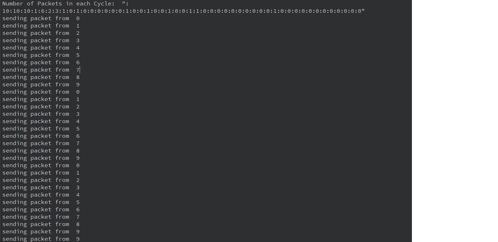
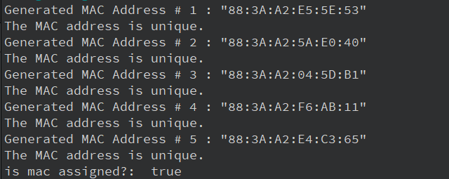

## Phase 1 Tests

### **Testing the EventCoordinator System**

To validate the functionality of the `EventCoordinator` system, we implemented `Node` and `PC` classes. These were used to simulate PCs that receive data packets at regular intervals, as coordinated by the EventCoordinator.

#### **Node and PC Implementation**

The `Node` class serves as a base class for the `PC`, representing individual PCs in the system. Each PC can send data packets when connected to the EventCoordinator and received a signal to do so.

**Node Header File:**
```cpp
#ifndef NODE_H
#define NODE_H

#include <QThread>
#include <QDebug>

class Node : public QThread
{
    Q_OBJECT

public:
    explicit Node(QObject *parent = nullptr);
};

#endif    // NODE_H
```

**PC Header File:**
```cpp
#ifndef PC_H
#define PC_H

#include "../Node/Node.h"
#include <QVector>
#include <QSharedPointer>

class PC : public Node
{
    Q_OBJECT

public:
    explicit PC(int id, QObject *parent = nullptr);

public Q_SLOTS:
    void sendPacket(QVector<QSharedPointer<PC>> selectedPCs);

protected:
    int m_id;
};

#endif    // PC_H
```

**PC Source File:**
```cpp
#include "PC.h"

PC::PC(int id, QObject *parent) :
    Node(parent)
{
    m_id = id;
}

void PC::sendPacket(QVector<QSharedPointer<PC>> selectedPCs) {
    if (!selectedPCs.contains(this))
        return;
    qDebug() << "sending packet from " << m_id;
}
```

#### **Testing with Main Function**

The `main` function demonstrates the simulation of the system by:

1. Creating an instance of `EventCoordinator` using its singleton pattern.
2. Initializing 10 PCs.
3. Connecting the EventCoordinator's `nextTick` signal to each PC's `sendPacket` slot.
4. Starting the simulation with an interval of 200 milliseconds and a total duration of 10,000 milliseconds.

**Main Function:**
```cpp
#include "../EventsCoordinator/EventsCoordinator.h"
#include <QCoreApplication>
#include <QObject>

int main(int argc, char *argv[])
{
    QCoreApplication app(argc, argv);

    EventsCoordinator *eventCoordinator = EventsCoordinator::instance();

    QVector<QSharedPointer<PC>> pcs;
    for (int i = 0; i < 10; i++) {
        QSharedPointer<PC> pc = QSharedPointer<PC>::create(i);
        pcs.append(pc);

        QObject::connect(eventCoordinator, &EventsCoordinator::nextTick, pc.get(), &PC::sendPacket);
    }

    eventCoordinator->startSimulation(200, 10000, pcs);
    int result = app.exec();

    EventsCoordinator::release();

    return result;
}
```

---

#### **Output**

The system's test outputs include:
1. A debug log showing the number of data packets distributed in each cycle.
2. Logs for PCs receiving packets, indicating the PC ID.

**Output:**


This output validates that:
- Data distribution among cycles matches the configuration.
- Each PC correctly receives packets when selected.

### **Testing the MAC Address**

```cpp
#include <QCoreApplication>
#include <QDebug>
#include "MACAddress/MACAddress.h"

int main(int argc, char *argv[])
{
    QCoreApplication a(argc, argv);

    std::array<uint8_t, 6> addressArray = {0x12, 0x34, 0x56, 0x78, 0x9A, 0xBC};
    MACAddress mac1(addressArray);
    qDebug() << "MACAddress from array:" << mac1.toString(); //12:34:56:78:9A:BC

    MACAddress mac2("AB:CD:EF:12:34:56");
    qDebug() << "MACAddress from valid string:" << mac2.toString(); //AB:CD:EF:12:34:56

    MACAddress mac3("INVALID:ADDRESS");
    qDebug() << "MACAddress from invalid string:" << mac3.toString(); //00:00:00:00:00:00

    qDebug() << "Is '12:34:56:78:9A:BC' valid?" << mac2.isValid("12:34:56:78:9A:BC"); // true
    qDebug() << "Is 'INVALID' valid?" << mac2.isValid("INVALID"); //false

    MACAddress mac4("12:34:56:78:9A:BC");
    qDebug() << "Are mac1 and mac4 equal?" << (mac1 == mac4); // true
    qDebug() << "Are mac2 and mac4 equal?" << (mac2 == mac4); // false

    return 0;
}
```

**What is being tested**:
1. **MAC Address Initialization**: We test if the `MACAddress` class can correctly handle MAC address initialization from both a byte array and a valid string. Additionally, we check how the class handles an invalid string (expecting it to default to `00:00:00:00:00:00`).
   
2. **MAC Address Validation**: The `isValid()` method is tested to ensure it accurately identifies valid MAC addresses (e.g., `12:34:56:78:9A:BC`) and rejects invalid strings (e.g., `INVALID`).
   
3. **Equality Check**: The `==` operator is tested for comparing two `MACAddress` objects, verifying that the operator correctly identifies equality when two addresses are the same and inequality when they differ.

**Desired Output**:
1. **MACAddress from array**: The output should display `12:34:56:78:9A:BC`, confirming that the class can properly initialize a MAC address from a byte array.
   
2. **MACAddress from valid string**: The output for this MAC address should be `AB:CD:EF:12:34:56`, showing that the class correctly parses a valid MAC address string.

3. **MACAddress from invalid string**: The output should be `00:00:00:00:00:00`, indicating that the class defaults to the "zero" address when provided with an invalid string like `INVALID:ADDRESS`.

4. **MAC Address validation**:
   - It should print `true` for the valid MAC address `12:34:56:78:9A:BC`.
   - It should print `false` for the invalid string `INVALID`.

5. **Equality Check**:
   - It should print `true` when comparing `mac1` and `mac4` because they are the same.
   - It should print `false` when comparing `mac2` and `mac4`, as they are different addresses.

#### **Output**


### Testing the MAC Address Generator

```cpp
#include <QDebug>
#include "MACAddress/MACAddress.h"
#include "MACAddress/MACAddressGenerator.h"

int main()
{
    QList<MACAddress> generatedMACs;

    for (int i = 0; i < 5; ++i) {
        MACAddress randomMAC = MACAddressGenerator::getRandomMAC();
        qDebug() << "Generated MAC Address #" << (i + 1) << ":" << randomMAC.toString();

        bool isUnique = true;
        for (const auto& mac : generatedMACs) {
            if (mac == randomMAC) {
                isUnique = false;
                break;
            }
        }

        if (isUnique) {
            qDebug() << "The MAC address is unique.";
        } else {
            qDebug() << "The MAC address is not unique.";
        }

        generatedMACs.append(randomMAC);
    }
    MACAddress tempMac(generatedMACs.first().toString());
    qDebug() << "is mac assigned?: " << MACAddressGenerator::isMACAssigned(tempMac);
    return 0;
}
```

**What is being tested**:
1. **Random MAC Address Generation**: The `MACAddressGenerator` class is tested to ensure it generates random and valid MAC addresses. We expect the generated addresses to follow the correct format (six groups of two hexadecimal characters separated by colons).

2. **Uniqueness of Generated MAC Addresses**: Each generated MAC address is checked for uniqueness within the current run. We test if the generator produces duplicates by comparing each newly generated address to the previously generated ones.

3. **MAC Address Assignment**: After generating five MAC addresses, we test whether the first MAC address in the list has already been assigned using `isMACAssigned()`. This verifies that the generator is keeping track of generated addresses.

**Desired Output**:
1. **Generated MAC Addresses**: Each of the five generated MAC addresses should be printed in valid MAC address format (e.g., `Generated MAC Address #1: XX:XX:XX:XX:XX:XX`), with each address being different.

2. **Uniqueness Check**: After generating each address, the system should output whether the generated MAC address is unique:
   - "The MAC address is unique." if the address has not been seen before in the current run.
   - "The MAC address is not unique." if the address is a duplicate.

3. **Assigned MAC Check**: After generating the five addresses, the program checks if the first address is assigned by calling `isMACAssigned()`. It will print either `true` or `false`, depending on whether the address has been previously assigned.

#### **Output**

